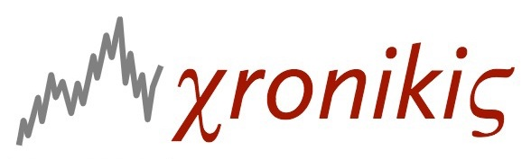

# 

Chronikis (kroh-NEE-kees) is a special-purpose language for creating time-series models. It comes with a compiler `chronikisc` and an R package `chronikis` that contains utilities for calling the compiler as well as estimating and forecasting with the compiled time-series models.

The name "Chronikis" is derived from the phrase **χρονική σειρά** (chronikí seirá), which means "time series" in Greek.

A PDF of the Chronikis manual, which includes installation instructions, may be found at [doc/chronikis-manual.pdf](doc/chronikis-manual.pdf).

**This initial release is still missing a number of functions and distributions that the language ought to have; the focus was on implementing enough that all of the models in `compiler/Acceptance` could be compiled.**

### Contributing

Contributions are welcome! Read the [Contributing Guide](./.github/CONTRIBUTING.md) for more information.

### Licensing

This project is licensed under the Apache V2 License. See [LICENSE](LICENSE) for more information.
